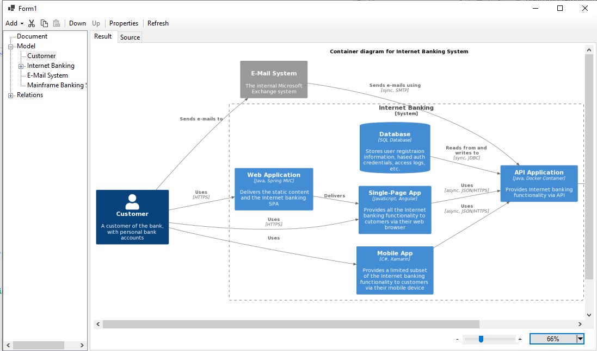
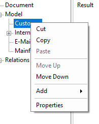
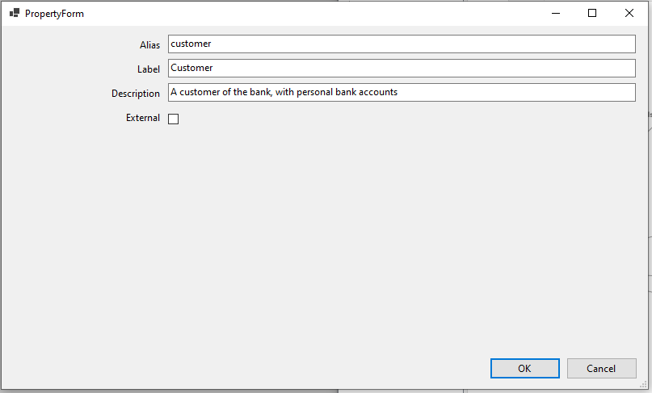
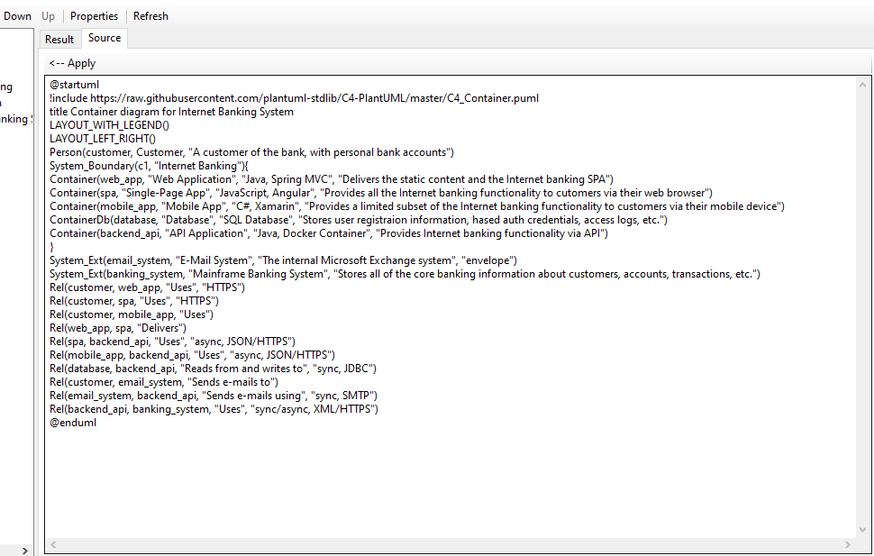

# C4Editor
# What it is
This application is a visual editor for creating C4 Diagrams.  C4 diagrams are useful for documenting system architectures and interconnection of the different modules and users.

The C4 method of describing architecture as code was originally presented by Simon Brown and is very well described at [https://c4model.com/](https://c4model.com/ "https://c4model.com/")

There are implementations of creating these diagrams using many different programming languages.

I had a need on a project for a more visual approach to creating these diagrams.  This project is the result.

It is written as a Windows Forms application, utilizing .Net 6.

It reads and writes Plant-UML (.puml) files, which can be stored in version control.  

Internally, this application parses the .puml file and displays the components on the tree on the left and as text on the right hand panel.  The visualization is provided by the Plant-UML web server.

This is the editor

In order to add a module or edit properties of existing modules, right click on the tree on the left

Below is a sample of a property sheet

By selecting the "Source" tab, you can see the Plant-UML source code

# Environment Requirements
Windows computer

Visual Studio 2022

# How to build it
Download the source

Open Visual Studio 2022 - The project compiles using .Net 6

Execute the application

